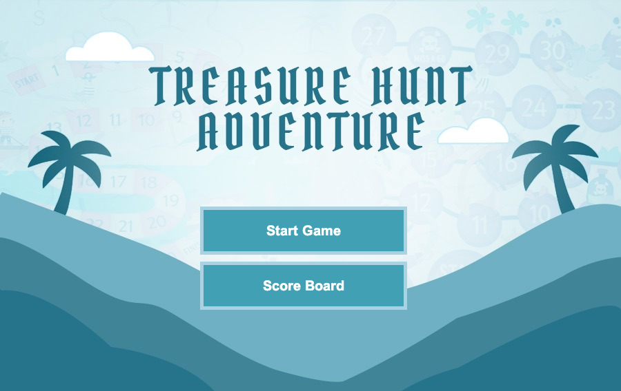
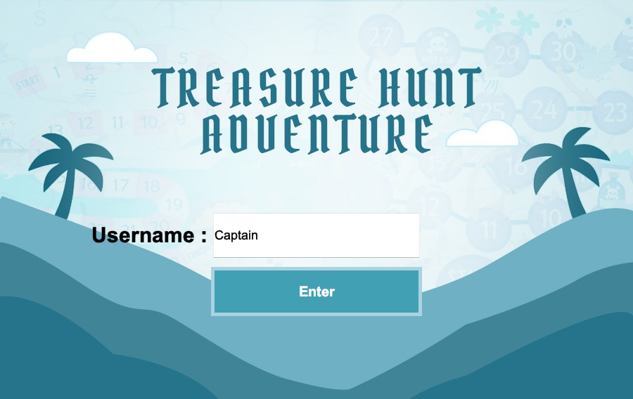
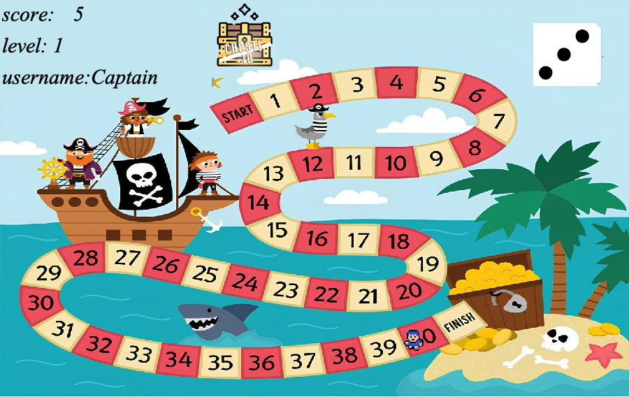
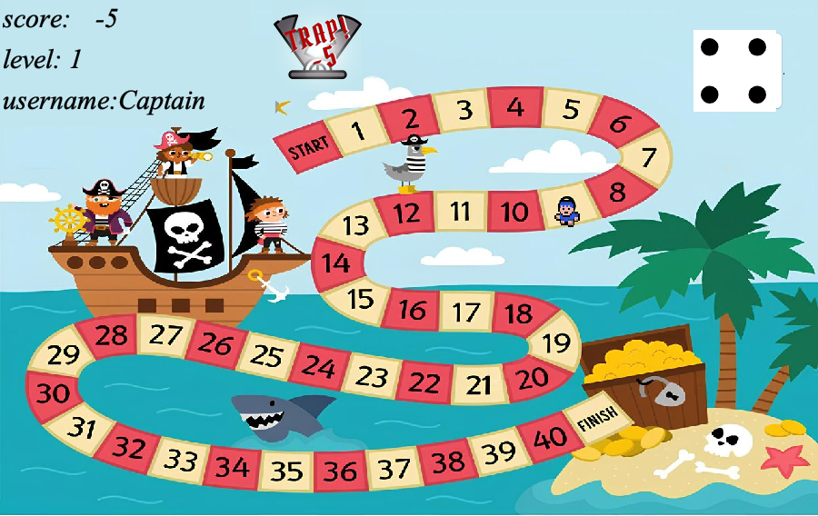
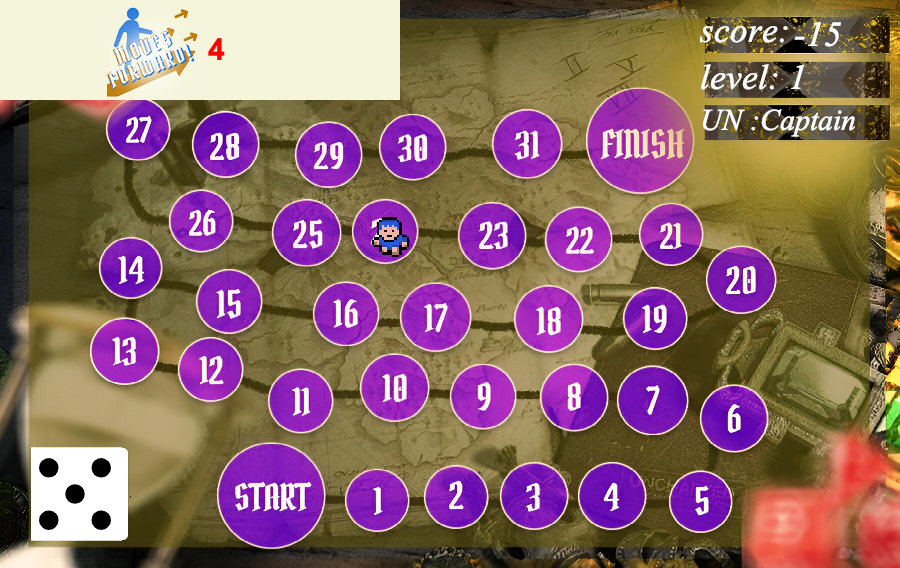
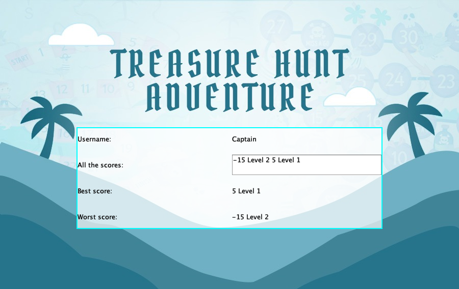

# 🗺️ Treasure Hunt Adventure

**A two-level dice-roll treasure board game in Java Swing. The game boards are built on custom linked lists and the scoreboard on a binary search tree, made for a Data Structures course.**

<p>
  
  
  
</p>

👥 Team: Saed O S Radi, Abdulrahman Zeineddin — university course project (FSMVU)

---

## Overview

Treasure Hunt Adventure is a pirate-themed board game. You enter a username, roll an animated die and move your pirate along a path of tiles. Each tile can hold treasure, a trap or, in Level 2, a push forward or backward. Tile contents are **randomised on every run**, and each finished level's score is saved and can be reviewed on the **Score Board**.

The project's focus is the data structures behind the game. Both boards are custom generic **linked lists** (singly linked for Level 1, doubly linked for Level 2), and the scoreboard is a **binary search tree** built from the saved scores. No Java collections are used for any of them.

<p align="center"></p>

## How to Play

1. Click **Start Game**, type a username and press **Enter**.
2. **Level 1:** click **Roll Dice**. The die animates, lands on 1–6, and your pirate walks that many tiles. The tile you land on decides your score:

   | Tile | Effect |
   |---|---|
   | 🪙 Chest | **+10** points |
   | 🪤 Trap | **−5** points |
   | Empty | no change |

3. When you reach the last tile, your score is saved and the game asks whether to **continue to Level 2**.
4. **Level 2** adds two tile types, each with a random number of steps:

   | Tile | Effect |
   |---|---|
   | ➡️ Move forward | jump ahead extra tiles |
   | ⬅️ Move backward | fall back tiles |

   The panel at the top shows the tile type, the move direction and the number of extra steps.
5. Finish Level 2 to save your score and return to the menu.
6. **Score Board:** enter a username to see all of that player's scores (sorted), plus their best and worst.

### Controls

The game is played with the **mouse only**: the menu buttons, the username field + **Enter** button, and **Roll Dice**. There are no keyboard controls.

## Screenshots

| Username | Level 1: treasure chest (+10) |
|:---:|:---:|
|  |  |

| Level 1: trap (−5) | Level 2: move backward |
|:---:|:---:|
|  |  |

| Level 2: move forward | Score Board (BST) |
|:---:|:---:|
|  |  |

## Data Structures

All three structures are written from scratch in the `testgame` package.

### Singly linked list: Level 1 board (`ZeineddinRadiLinkedlist<E>`)

- Level 1 uses two lists. `pathPoints` stores the (x, y) screen position of each of the 42 positions on the board image (Start, tiles 1–40, Finish). `board` holds the same positions as the playable tiles, each with a random **type** (empty, chest or trap).
- A cursor node `ptemp` marks the player's tile. Rolling *n* advances it *n* times along `next` links, one animated step at a time, and the score updates from the type of the tile it stops on.
- Reaching a node whose `next` is `null` ends the level.

### Doubly linked list: Level 2 board (`ZeineddinRadiD_Linkedlist<E>`)

- The same two-list layout (`pathPoints` and `board`), but every node also has a `prv` link, and the list keeps a `tail` pointer.
- Each tile gets a random **type** (empty, chest, trap, move forward, move backward) and a random **value** for movement tiles.
- **Moving forward** follows `next` links (`movefor`). **Moving backward** follows `prv` links (`moveforb`), which is why Level 2 needs a doubly linked list. A move that would run past either end stops at `head` or `tail`.

Both lists share one node class, `ZeineddinRadiNode<E>` (`data`, `type`, `value`, `next`, `prv`).

### Binary search tree: Score Board (`ZeineddinRadiBinarySearchTree`)

- Each finished level appends a line `username, level, score` to `score.txt` (`ZeineddinRadiFiles`).
- When a player opens the Score Board, the file is read line by line. Every record for that username, matched case-insensitively, is **inserted into a BST keyed by score**. Nodes are `ZeineddinRadiTnode` (`score`, `username`, `level`, `left`, `right`); the insert method is called `traversal()`.
- An **in-order traversal** (`inOrder()`) lists all scores from lowest to highest. The **leftmost** node (`getMin()`) is the worst score and the **rightmost** node (`getMax()`) is the best.

## OOP Design

| Class | Role |
|---|---|
| `ZeineddinRadiMain` | Entry point; opens the menu |
| `ZeineddinRadiMenu` (`JFrame`) | Main menu, username screen and Score Board; builds the BST from `score.txt` |
| `ZeineddinRadiGamePanel` (`JPanel`) | Level 1: draws the board and player, dice animation, movement and scoring on a singly linked list |
| `ZeineddinRadiGameBoard` (`JPanel`) | Level 2: the same, plus forward/backward tiles, on a doubly linked list |
| `ZeineddinRadiFiles` | Appends a level result to `score.txt` |
| `ZeineddinRadiLinkedlist<E>`, `ZeineddinRadiD_Linkedlist<E>`, `ZeineddinRadiNode<E>` | Generic singly and doubly linked lists and their shared node |
| `ZeineddinRadiBinarySearchTree`, `ZeineddinRadiTnode` | Score BST and its node |

**How they connect:** `Main` → `Menu` → (Start Game) `GamePanel` (Level 1) → (continue) `GameBoard` (Level 2) → back to `Menu`. Both levels save results through `Files`, and `Menu` reads them back into the BST.

The two levels are custom `JPanel`s that override `paintComponent()` to draw the board image and the player sprite, and they use Swing `Timer`s for the dice animation and step-by-step movement. The design is plain classes and composition: no interfaces, inheritance hierarchies or design patterns beyond extending the Swing `JFrame` / `JPanel` classes.

## How to Run

Requires **JDK 21** (the NetBeans project targets Java 21).

**NetBeans:** open the folder as a project and press *Run*.

**Command line:**

```bash
mkdir -p build/classes
javac -d build/classes src/testgame/*.java
cp -R src/testgame/images build/classes/testgame/
java -cp build/classes testgame.ZeineddinRadiMain
```

**Ant:** `ant jar` builds `dist/testgame.jar`; run it with `java -jar dist/testgame.jar`.

Scores are saved to `score.txt` in the directory you run the game from.

## Project Report

[`docs/report.pdf`](docs/report.pdf) is the original course report (11 pages). It covers each screen, the data-structure design, a design revision made after instructor feedback, and the challenges the team faced. Student numbers have been redacted.

## Notes

- **Portability fix.** The original code loaded every image and the score file from hard-coded Windows paths (`A:\java projects\testgame\...`), so it only ran on the developers' machine. Images now load as classpath resources (`getResource("/testgame/images/...")`) and scores are kept in `score.txt` in the working directory. No gameplay changes were made.
- **Known issue.** The Level 2 screen still shows "level: 1" in its info panel, a leftover label in `ZeineddinRadiGameBoard`. Saved Level 2 scores are correctly recorded as "Level 2".

## Credits

Level 1 board image provided by the course instructor. The menu and Level 2 backgrounds and the tile icons were designed by the team in Adobe Photoshop.
